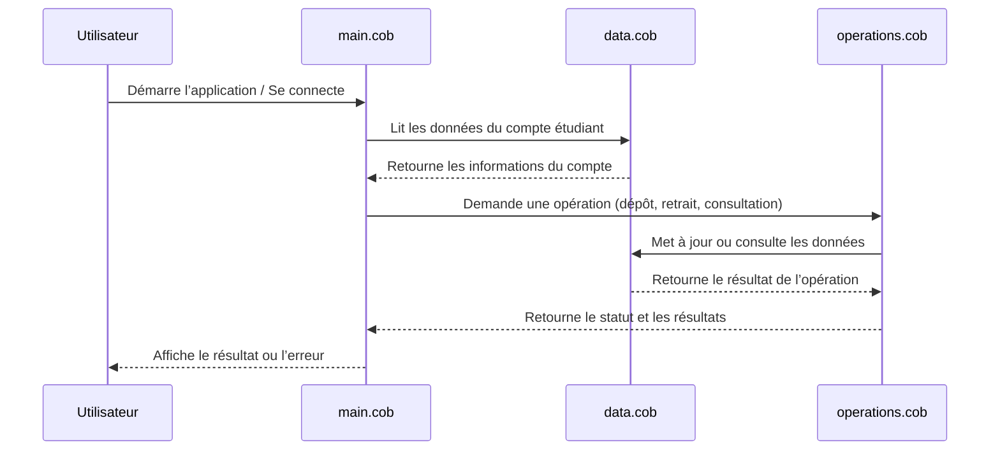

# Documentation des fichiers COBOL

Ce projet modernise un système COBOL gérant les comptes étudiants. Vous trouverez ci-dessous la description des fichiers principaux, leurs fonctions clés et les règles métier spécifiques.

## Fichiers COBOL

### `main.cob`
- **But** : Point d'entrée du programme COBOL.
- **Fonctions clés** :
  - Initialise l'application.
  - Gère le flux principal : lecture des données, appel des opérations, affichage des résultats.
- **Règles métier** :
  - Contrôle l'accès aux opérations selon le type d'utilisateur (étudiant, administrateur).

### `data.cob`
- **But** : Gestion des données des comptes étudiants.
- **Fonctions clés** :
  - Lecture, écriture et mise à jour des informations des étudiants (nom, identifiant, solde, statut).
  - Validation des données lors de la création ou modification d'un compte.
- **Règles métier** :
  - Un identifiant étudiant doit être unique.
  - Le solde initial doit respecter les politiques de l'établissement.

### `operations.cob`
- **But** : Implémentation des opérations sur les comptes étudiants.
- **Fonctions clés** :
  - Dépôt et retrait sur le compte étudiant.
  - Consultation du solde et de l’historique des transactions.
  - Gestion des statuts de compte (actif, suspendu, clôturé).
- **Règles métier** :
  - Les retraits ne peuvent pas dépasser le solde disponible.
  - Certaines opérations sont réservées aux administrateurs.

## Règles métier spécifiques
- Un étudiant ne peut effectuer des opérations que sur son propre compte.
- Les administrateurs peuvent consulter et modifier tous les comptes.
- Les transactions sont enregistrées pour audit et conformité.

---

## Diagramme de séquence : Flux de données de l’application

---
Pour toute question ou pour contribuer à la modernisation, consultez le fichier principal ou contactez l’équipe projet.
